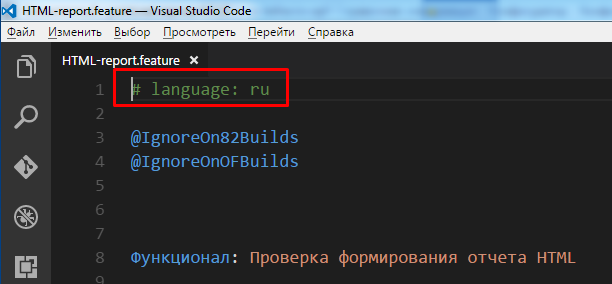
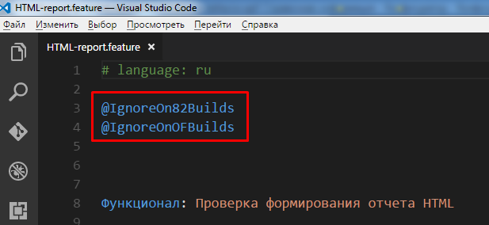
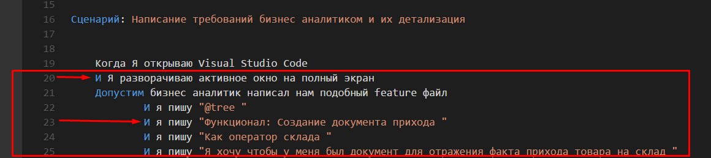

**Vanessa-Behavior** - это фреймворк для разработки в 1С используя методологию BDD.

Страница проекта: [https://github.com/silverbulleters/vanessa-behavior](https://github.com/silverbulleters/vanessa-behavior)
Vanessa-Behavior является аналогом Cucumber для разработки на платформе 1С:Предприятие.

Поддерживаются версии платформы:

> 8.2.19, 8.3.6, 8.3.7, 8.3.8, 8.3.9, 8.3.10

У обработки есть **Управляемая форма** (она является основой) и **Обычная форма**.

> Обычная форма поддерживается в **ограниченном** формате. Т.е. ошибки исправляются - новые фичи добавляются редко. Но вы можете добавить в неё нужные Вам фичи самостоятельно.

Разделы справки: 

1. [Правила написания feature файлов](#ПравилаНаписанияfeatureФайлов)
    1.1. [Основные секции feature файла](#ОсновныеСекцииFeatureФайла)
         1.1.1. [Заголовок feature](#Заголовок)
         1.1.2. [Сценарии](#Сценарии)
         1.1.3. [Структура сценария](#Структура_сценария)
    1.2. [Тег @tree](#Tag_tree)
    1.3. [Тег @exportscenarios](#ТегExportScenarios)
    1.4 Передача в шаг таблицы.
    1.5 Вызов структуры сценария как вложенного сценария.
    1.6 Передача параметра таблицы (таблиц) во вложенный сценарий.
2. [Как загрузить feature файл. Тэги.](#Как_загрузить_feature_файл)
3. [Как запустить feature файл на выполнение. Отладка.](#Как_запустить_feature_файл_на_выполнение_Отладка)
4. [Как создать epf файл на основе feature файла](#Как_создать_epf_файл_на_основе_feature_файла) 
5. Описание настроек на закладке Сервис. 
6. Асинхронные вызовы 
7. Как получить отчет Allure, jUnit, Cucmber report. 
8. [Быстрое создание файла сценария](#Быстрое_создание_файла_сценария) 
9. Как получить состояние формы TestClient. 
10. Как подключить свою библиотеку. 
11. Как поделиться своими шагами с коллегами при групповой разработке. 
12. Как создать автоинструкцию в формате HTML, MD. 
13. Как создать автовидеоинструкцию. 
14. Список экспортных процедур и функций. 
15. Запуск Vanessa-Behavior на CI. 
16. Инструкция для контрибьютерров.

## <a name="ПравилаНаписанияfeatureФайлов">1. Правила написания feature файлов.</a>

### <a name="ОсновныеСекцииFeatureФайла">1.1 Основные секции feature файла.</a>

Feature файл должен быть написан на языке **Gherkin**.

Feature файл содержит в себе две основные секции - это заголовок фичи и её сценарии.

#### <a name="Заголовок">Заголовок</a>

Заголовок фичи содержит в себе служебную секцию с директивой, указывающими на язык (русский, английский и т.д.) фичи.

Далее в заголовке обычно идут теги, которые относятся ко всей фиче (ещё бывают теги, которые относятся к конкретному сценарию).

Далее идёт часть, в которой используется ключевое слово **Функционал** или **Функциональность** и далее идёт название фичи.

Далее идёт часть, в которой коротко даётся ответ на три вопроса: кто хочет, что он хочет и зачем это надо (бизнес польза).

Далее идёт необязательная секция **Контекст**.  
В ней обычно описывают шаги, которые подготавливают выполнения сценария, но непосредсвенно к нему не относятся.  
В одном feature файле может быть много сценариев, и секция **Контекст** будет выполняться перед каждым сценарием.  

Далее идёт часть в которой могут распологаться либо простые сценарии, либо сценарии специального формата, которые в русском переводе "**Scenario Outline"** получили название "**Структура сценария"**.

#### <a name="Сценарии">Сценарии</a>

Обычный сценарий начинается с ключевого слова "**Сценарий:**", затем идёт имя сценария.

Далее идут шаги сценария. Каждый шаг должен начинаться с ключевого слова, такого как **Дано**, **Когда**, **Тогда**, **И**, **Затем** и т.д.

Полный список ключевых слов для каждого языка можно посмотреть здесь: [https://github.com/cucumber/gherkin/blob/master/gherkin-languages.json#L2372](https://github.com/cucumber/gherkin/blob/master/gherkin-languages.json#L2372)
Ограничений на количество использований ключевых слов шагов нет. 

У шагов могут быть параметры простых типов - число, строка, дата.
Числа записываются как есть.

Даты могут быть указны в двух форматах

Строки должны быть заключены либо в апострофы, либо в кавычки.

**Для строк действуют правила экранирования спецсимволов.**

**\\'** - означает апостроф  
**\\"** - означает кавычку  
**\\\\** - означает одинарный слеш (\\)  

#### <a name="Структура_сценария">Структура сценария</a>

Структура сценария допускает, что некторые параметры в шагах указываются в специальных скобках.
Такие параметры должны быть описаны в таблице, которая идёт после структуры сценария и начинается с ключевого слова **"Примеры"**.
Таким образом для каждой строки таблицы **Примеров** будет выполнен **свой** сценарий со **своим** набором параметров.

###  <a name="Tag_tree">1.2 Тег @tree</a>

Vanessa-Behavior умеет работать с **расширенным** синтаксисом языка сценариев **Gherkin**. Назовём его **Turbo Gherkin**. 

Если в заголовке фичи указан тег **@tree**, тогда парсер фич будет особым образом интерпритировать отступы (символы Tab, пробелы недопустимы!!!) в тексте. Шаги будут образовывать дерево шагов. Т.е. шаги с большим значением отступа будут считаться вложенными. Как в python. Это помогает структурировать текст feature файла.

Таким образом часть шагов оказалась внутри других шагов. Шаг, который является веткой дерева (выделен рамкой на картинке) - выполняться не будет.

### <a name="ТегExportScenarios">1.3 Тег @exportscenarios</a>

Если в заголовке фичи указан тег @exportscenarios, тогда становится возможным вызывать один сценарий из другого (и передавать в него свои параметры). Например есть такой сценарий, содержащий шаг **"Когда Я открываю Visual Studio Code"**: 

 рядом с ним (или в подчиенном каталоге, или в каталоге библиотек) лежит другой feature файл, у которого указан тег **@exportscenarios** и в нём есть сценарий с именем **"Я открываю Visual studio code"**.

Тогда если загрузить первый сценарий в Vanessa-Behavior - шаг **"Когда Я открываю Visual Studio Code"** загрузится как ветка дерева. 

Чтобы передать обычный параметр в подчиненный сценарий - надо чтобы строка с именем сценария содержала параметры. Например, есть вот такой сценарий: 

В него можно передать свой параметр **"ИмяФайла"**. 

Тогда в Vanessa-Behavior это отобразится вот так:

## 2. <a name="Как_загрузить_feature_файл">Как загрузить feature файл. Тэги.</a>

Vanessa-Behavior позволяет загрузить либо один feature файл (Ctrl+F2), либо feature файлы из каталога (Alt+F2). 

Если выбран пункт "Загрузить один файл" - тогда feature файл будет загружен не смотря на наличие в нём тегов. Если выбран пункт "Загрузить файлы из каталога" - тогда возможны варианты, в зависимости от указанных тегов в настройках Vanessa-Behavior. 

Если заполнен список "Список исключаемых тэгов" - тогда если в feature файле указан такой тэг в заголовке feature, весь feature файл не будет загружен. Если тэг был указан у одного или несклольких сценариев, данные сценарии не будет загружены, а остальные загрузятся. Если заполнен список "Тэги для запуска" - тогда если в feature данный тэг не встречается нигде - весь feature файл будет проигнорирован. Если тэг есть в заголовке feature, тогда будут загружены все сценарии из feature.
Если тэг указан у одного или нескольких сценариев - тогда будут загружены только эти сценарии.

## 3. <a name="Как_запустить_feature_файл_на_выполнение_Отладка">Как запустить feature файл на выполнение. Отладка.</a>

Что выполнить все сценарии надо нажать на кнопку "**Выполнить сценарии**". Если вы внесли изменения в epf или в фичу, тогда надо нажать на кнопку "**Перезагрузить сценарии**". Иначе будут использоваться старые версии фич и обработок. При постоянном внесении правок в фичу или в epf - удобно использовать кнопку "**Перезагрузить и выполнить**". Также в Vanessa-Behavior можно использовать следующие варианты запуска фич на выполнение (доступно в контекстном меню):

 
1. **Выполнить данный сценарий с текущего шага** (Ctrl+F5). Позволяет выполнить сценарий с текущего шага и до конца данного сценария. Другие сценарии выполняться не будут. 
2. **Выполнить данный сценарий с текущего шага с продолжением** (Ctrl+Shift+F5). Позволяет выполнить сценарий с текущего шага. Также будут выполнены сценарии следующие за данным. 
3. **Выполнить данный сценарий с начала** (Alt+F5).  Будет выполнен только данный сценарий начиная с первого шага. 
4. **Перезагрузить и выполнить данный сценарий** (Alt+F6).  Будут перечитаны даныне фича файлов, epf и будет выполнен только данный сценарий начиная с первого шага. 
5. **Выполнить сценарии этой фичи** (Ctrl+Alt+F5). Будут выполнены все сценарии данной фичи. 
6. **Выполнить один шаг** (F11). Будет выполнен только один шаг фичи. Можно выбрать любой шаг в дереве фич и выполнить его, включая шаги секции Контекст. Удобно использовать при отладке. 
7. **Открыть feature файл в редакторе**. Откроет приложение, которое ассоциировано с расширением **feature**. 
8. **Открыть каталог feature**. Откроет проводник с каталогом, где лежит feature файл. 
9. **Выполнять сценарий с этого шага с сохранением контекстов**. Будет выполнен сценарий с текущего шага. При этом будет выставлен флаг **Сохранять контексты перед выполнением шагов** на закладке **Сервис**, т.е.при выполении сценария будутзапоминаться значения контекстов шагов. При таком режиме запуска удобно делать отладку сценария, когда шаги зависят от значений переменных **Контекст** и **КонтекстСохраняемый**. При первом запуске сценария с данной опцией возможно выполнение сценария с начала, если флаг **Сохранять контексты перед выполнением шагов** ранее не был равен **Истина**. При последующих запусках сценарий будет выполняться с нужного шага. 
10. **Свернуть до фич**. Дерево фич будет свёрнуто до строк фич. 
11. **Свернуть до сценариев**. Дерево фич будет свёрнуто до строк сценариев.

 

12. **Брейкпоинт** (F9). У строки шага будет установлена отметка брейкпоинта. Выполнение сценариев будет прервано на этом шаге, при этом сам шаг выполнен не будет. Далее удобно выполнять отладку по одному шагу (F11). 
13. **Убрать все брейкпоинты** (Ctrl+F9). Убирает все брейкпоинты из дерева.

## **4. <a name="Как_создать_epf_файл_на_основе_feature_файла">Как создать epf файл на основе feature файла.</a>**

1. Если мы работаем в режиме управляемых форм - надо выставить флаг "**Генерировать управляемую форму**".
2. Если выставить флаг "**Создавать области при генерации кода**" - внутри epf будут созданы области кода.

3. Флаг "**Создавать закомментированный код для переиспользуемых процедур**" сейчас не используется.
4. Флаг "**Выводить текст получаемого модуля, вместо перегенрации EPF**" - позволяет вывести модуль в текстовый документ не создавая epf.
5.  Если epf уже существует, тогда в неё будут добавлены новые шаги. При этом существующие процедуры, функции, макеты и т.д. в epf сохранятся.
6.  Epf будет создана с тем же именем файла что и feature файл.
7.  EPF создаётся с помощью штатных средств платформы. В поле "**Версия платформы для генерации EPF**" надо указать путь к каталогу **bin** нужной версии платформы 8.3.10 или выше.
8.  Epf будет создана в каталоге "**step_definitions**", который будет находится в каталоге feature файла.
9.  Каждая epf должная обладать уникальным значением в поле "**Имя**". Если вы копируете (а не перемещаете) epf в другой каталог, тогда надо обеспечить уникальность этого поля.

## <a name="Быстрое_создание_файла_сценария">8. Быстрое создание файла сценария</a>

### Запись поведения пользователя

1. На вкладке «Работа с UI» имеется набор кнопок, отвечающих за взаимодействие с клиентом тестирования из Vanessa Behavior.
«Подключит TestClient» - запуск клиента тестирования
«Начать запись поведения» - запуск клиента тестирования и начало запись журнала действий пользователя.
«Закончить запись поведения» - останавливает запись журнала действий пользователя и производит автоматическую конвертацию в сценарий на языке Gherkin.

### Создание сценария через запись действий пользователя.

Используя данную последовательность шагов удобно просить сотрудников компании воспроизвести ошибку в конфигурации или порядок рабочий действий для создания фичи и уменьшения технического долга.

1. На рабочем месте пользователя запускаем конфигурацию в режиме предприятия с установленным параметром запуска **/UILogRecorder**

2. Нажимаем «Начать запись»

3. Просим пользователя воспроизвести последовательность действий и по окончании нажимаем кнопку «Завершить»

4. Откроется файл журнала действий пользователя, который необходимо сохранить и передать разработчику

5. В дальнейшем для получения сценария на языке Геркин необходимо в обработке Vanessa Behavior перейти на вкладку «Работа с UI -> Исходный XML». Вставить содержимое журнала действий пользователя в соответствующее окно.

Нажать кнопку «Преобразовать исходный XML» и получить готовый сценарий.

В дальнейшем полученный сценарий нужно отредактировать – заполнив описательную часть сценария.

### Используя каталог известных шагов

Для добавления шагов в сценарий достаточно нажать кнопку «Добавить известные шаги» и добавить нужный функционал сценария двойным кликом мышки на нужной строке.

### Запуск воспроизведения полученного сценария

1. Сохраняем полученный сценарий и запускаем так, как описано в разделе [Как загрузить feature файл. Тэги.](#Как загрузить feature файл)
2. Для быстрой проверки корректности сценария нажимаем кнопку «Подготовить сценарий к выполнению». В этом случае произойдет загрузка сценария аналогично использованию команды «Загрузить фичи -> Загрузить один файл»

**Внимание.**  Полученный сценарий сохраняется в файл во временной директории операционной системы. В случае использования функции «[Генерация EPF](#Как_создать_epf_файл_на_основе_feature_файла)», полученная таким образом обработка сохраниться рядом с файлом фичи.